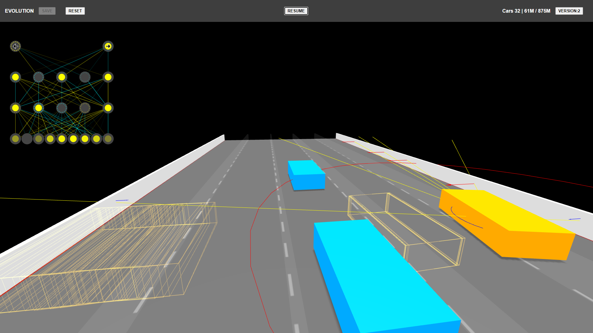
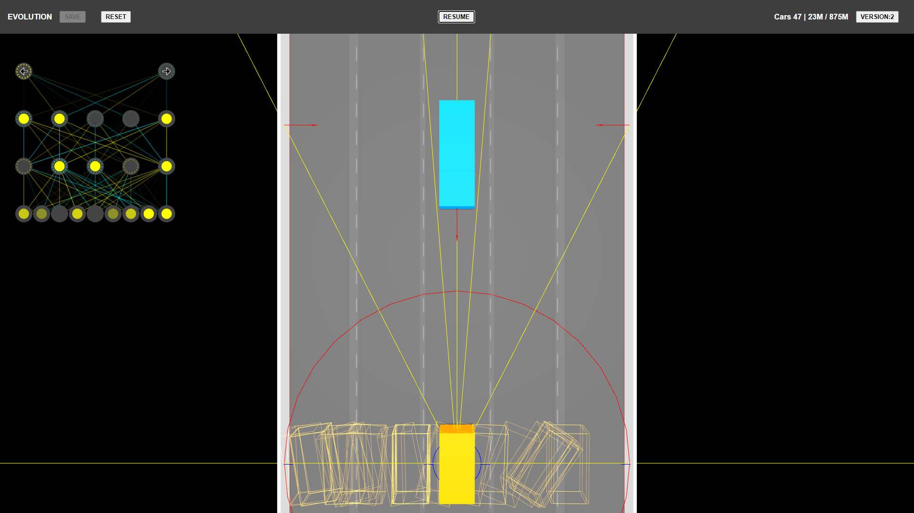

# Evolution

This project was generated with [Angular CLI](https://github.com/angular/angular-cli) version 16.0.5.

## Description
[Threejs](https://threejs.org) implementation
of [Radu Mariescu-Istodor](https://www.youtube.com/watch?v=NkI9ia2cLhc&list=PLB0Tybl0UNfYoJE7ZwsBQoDIG4YN9ptyY)
AKA (The Legend) driving evolution neural network.

## Details

- On the top you can see the current evolution version, the number of cars running, the current score and the last best score.
We only save the evolution if it makes a better score.
- Each evolution has 100 instances of the same neural network with a .1 mutation.
- The neural network has 9 inputs, 2 hidden layers with 5 neurons each and 2 outputs.
- The inputs are the distance to the left and right wall, the current land and the distance to the next obstacle.
- Inputs from 1 to 7 are:
1. Left limit, 
2. 5 front sensors 
3. 1 Right limit.
- Input 8 is the angle of the car.
- Input 9 is the center of a lane.
- The outputs are Left or Right.

## Development server

Run `ng serve` for a dev server. Navigate to `http://localhost:4200/`. The application will automatically reload if you change any of the source files.

## Code scaffolding

Run `ng generate component component-name` to generate a new component. You can also use `ng generate directive|pipe|service|class|guard|interface|enum|module`.

## Build

Run `ng build` to build the project. The build artifacts will be stored in the `dist/` directory.

## Running unit tests

Run `ng test` to execute the unit tests via [Karma](https://karma-runner.github.io).

## Running end-to-end tests

Run `ng e2e` to execute the end-to-end tests via a platform of your choice. To use this command, you need to first add a package that implements end-to-end testing capabilities.

## Further help

To get more help on the Angular CLI use `ng help` or go check out the [Angular CLI Overview and Command Reference](https://angular.io/cli) page.
